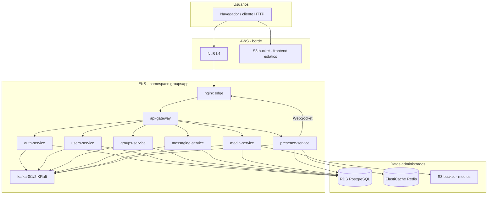
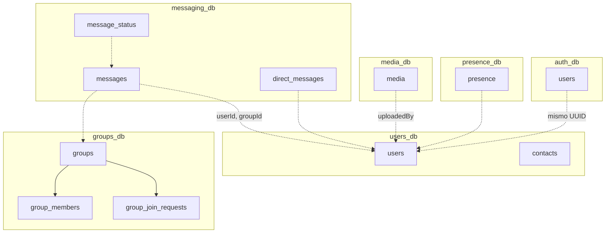
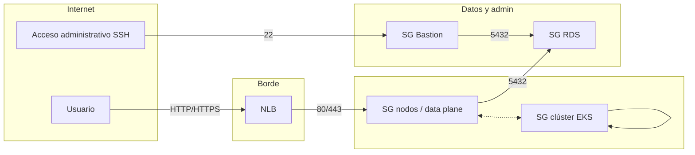

# GroupsApp — Informe de arquitectura, despliegue en AWS (EKS) y alineación con el enunciado del curso

**Proyecto:** ST0263 / SI3007 — Sistemas Distribuidos, 2026-1  
**Aplicación:** GroupsApp (mensajería grupal e instantánea)  
**Alcance:** descripción de la arquitectura desplegada, servicios AWS utilizados, modelo de datos, trazabilidad frente a los requisitos del *enunciado* del curso, pruebas ejecutadas y medidas de seguridad aplicadas.

---

## Tabla de contenidos

1. [Alcance y estructura del documento](#1-alcance-y-estructura-del-documento)
2. [Estructura del repositorio](#2-estructura-del-repositorio)
3. [Resumen ejecutivo](#3-resumen-ejecutivo)
4. [Arquitectura lógica](#4-arquitectura-lógica-vista-de-componentes)
5. [Inventario de microservicios](#5-inventario-de-microservicios)
6. [Modelo relacional de datos](#6-modelo-relacional-de-datos)
7. [Despliegue en AWS: servicios y responsabilidades](#7-despliegue-en-aws-servicios-y-responsabilidades)  
   - [7.8. IaaS, PaaS y SaaS en el despliegue](#iaas-paas-saas)
8. [Manifiestos Kubernetes](#8-manifiestos-kubernetes-directorio-k8s)
9. [Matriz: enunciado y evidencia en el sistema](#9-matriz-enunciado-y-evidencia-en-el-sistema)
10. [Pruebas](#10-pruebas)  
   - [10.5. Pruebas automáticas en el repositorio (CI)](#pruebas-automáticas-repo)
11. [Seguridad](#11-seguridad)
12. [Contenido entregable del proyecto](#12-contenido-entregable-del-proyecto)
13. [Referencias de archivos en el repositorio](#13-referencias-de-archivos-en-el-repositorio)
14. [Decisiones de arquitectura relevantes](#14-decisiones-de-arquitectura-relevantes)
15. [Herramientas de asistencia utilizadas](#15-herramientas-de-asistencia-utilizadas)

---

## 1. Alcance y estructura del documento

El presente informe recoge:

- La arquitectura del sistema en **Amazon Web Services** con orquestación en **Amazon EKS** (Kubernetes).  
- La correspondencia entre los requisitos del *enunciado* del curso (funcionales y no funcionales) y la implementación (código, manifiestos `k8s/`, servicios gestionados).  
- El **modelo relacional de datos** por microservicio.  
- El procedimiento de **aplicación de manifiestos**, variables de entorno y comprobaciones realizadas.  
- Las **pruebas** llevadas a cabo sobre el plano de datos (salud vía NLB, drenado de nodo, S3, Kafka).  
- El modelo de **Security Groups** y medidas de seguridad en capa de red y aplicación.

---

## 2. Estructura del repositorio


| Ubicación                                  | Contenido                                                                                                                             |
| ------------------------------------------ | ------------------------------------------------------------------------------------------------------------------------------------- |
| `app/`, `components/`, `lib/`, `contexts/` | Frontend Next.js: interfaz, cliente HTTP, autenticación, WebSocket hacia el servicio de presencia.                                    |
| `api-gateway/`                             | API Gateway HTTP: punto de entrada unificado hacia los microservicios.                                                                |
| `services/*-service/`                      | Microservicios NestJS: auth, users, groups, messaging, media, presence.                                                               |
| `proto/`                                   | Definiciones **gRPC** (users, groups, messaging) según servicio.                                                                      |
| `k8s/`                                     | Manifiestos de despliegue: namespace, ConfigMap, plantilla de secretos, Kafka, aplicaciones, *edge* nginx, NLB, opcional Ingress ALB. |
| `docker-compose.yml`                       | Entorno local equivalente: PostgreSQL por servicio, Kafka, Redis, Consul, monitoreo opcional.                                         |
| `scripts/aws/`                             | Scripts de apoyo (p. ej. creación y política de bucket S3 para medios).                                                               |
| `monitoring/`                              | Configuración Prometheus, Grafana y Loki para el entorno local.                                                                       |


El mismo código admite despliegue local con Docker Compose y frontend en modo desarrollo, o despliegue en EKS según el orden de `kubectl apply` descrito en la sección 8.

---

## 3. Resumen ejecutivo


| Tema                           | Decisión implementada                                                                                                                                                                                                                                                                                                                                                                                |
| ------------------------------ | ---------------------------------------------------------------------------------------------------------------------------------------------------------------------------------------------------------------------------------------------------------------------------------------------------------------------------------------------------------------------------------------------------- |
| Orquestación                   | **Amazon EKS** (Kubernetes administrado).                                                                                                                                                                                                                                                                                                                                                            |
| Exposición pública del backend | **Network Load Balancer (NLB)** y **nginx** como *edge*; enrutamiento L7 hacia el API Gateway y *presence-service*.                                                                                                                                                                                                                                                                                  |
| Base de datos relacional       | **Amazon RDS** para **PostgreSQL**; bases lógicas por servicio; conexión con **TLS**; configuración **Multi-AZ** según consola.                                                                                                                                                                                                                                                                      |
| Caché / presencia              | **Amazon ElastiCache (Redis)**; URL suministrada vía secreto `redis.url`.                                                                                                                                                                                                                                                                                                                            |
| Mensajería asíncrona           | **Apache Kafka 3.7** en **modo KRaft** (tres *brokers* en *StatefulSet*).                                                                                                                                                                                                                                                                                                                            |
| Objetos / medios               | **Amazon S3** con subida vía SDK y URLs de objeto; buckets y políticas según script y configuración.                                                                                                                                                                                                                                                                                                 |
| Frontend estático              | Build **Next.js** con `output: "export"`; estáticos alojados en **S3** (sincronización con `aws s3 sync` u operación equivalente).                                                                                                                                                                                                                                                                   |
| Alta disponibilidad de *pods*  | **Réplicas ≥ 2** en servicios críticos, **anti-afinidad** y **PodDisruptionBudgets**.                                                                                                                                                                                                                                                                                                                |
| Comprobación de resiliencia    | **Drain** de nodo worker y verificación de endpoint `/health` a través del NLB.                                                                                                                                                                                                                                                                                                                      |
| **Security Groups**            | Reglas *stateful* en **ENI** (EC2 / VPC, extendidas a RDS y ElastiCache): tráfico hacia el NLB y hacia el *data plane* en **TCP 80/443**; **RDS** con motor accesible en el puerto configurado (p. ej. **5432**) desde los *workers* de EKS y un **bastion** de administración; **ElastiCache** restringido al eje de la aplicación; **bastion** con **SSH (22)** según reglas definidas en consola. |


---

## 4. Arquitectura lógica (vista de componentes)




**Flujo:** el tráfico **HTTP** y **WebSocket** entra por el **NLB** hacia el *Deployment* `groupsapp-edge-nginx`, que enruta hacia `api-gateway` (REST) y hacia `presence-service` (Socket.IO bajo `/socket.io/`). Cada microservicio persiste en su base lógica en **RDS** (*database per service*). Los eventos de dominio se publican y consumen mediante **Kafka**. Los archivos se almacenan en **S3**; en base de datos se guardan metadatos (p. ej. `s3Key` y URL).

En la capa de red de la **VPC**, los **Security Groups** de **Amazon EC2** (también asociados a **RDS**, **ElastiCache** e interfaces del balanceador) definen orígenes y puertos permitidos hacia cada **ENI**: reglas entre *control plane* y *workers* del clúster EKS, tráfico desde el **NLB** hacia el *Service* del *edge* (p. ej. **80** o **443**), y acceso al motor **RDS** (p. ej. **5432**) desde los *workers* y el **bastion**; **ElastiCache** sigue un patrón análogo hacia el tráfico de `presence-service`. El acceso a **S3** y a la API pública de AWS se realiza por **HTTPS** e **IAM**, con políticas de *bucket* y CORS según el caso de uso.

---

## 5. Inventario de microservicios

Se implementan **seis microservicios** de negocio más el **api-gateway** (siete servicios lógicos con responsabilidad de aplicación y una capa de entrada HTTP).


| Servicio              | Rol                                        | Puerto HTTP | gRPC (interno) | Uso de Kafka                              |
| --------------------- | ------------------------------------------ | ----------- | -------------- | ----------------------------------------- |
| **api-gateway**       | Entrada REST, enrutamiento                 | 3000        | —              | —                                         |
| **auth-service**      | Registro, autenticación, JWT               | 3001        | —              | Productor                                 |
| **users-service**     | Perfiles, contactos, gRPC *users*          | 3002        | 50052          | Productor / consumidor                    |
| **groups-service**    | Grupos, administración, gRPC *groups*      | 3003        | 50053          | Productor                                 |
| **messaging-service** | Mensajes de grupo, DM, gRPC *messaging*    | 3005        | 50054          | Productor y consumidor (eventos de grupo) |
| **media-service**     | Metadatos y subida hacia S3                | 3004        | —              | Productor `file.`*                        |
| **presence-service**  | Presencia en tiempo real, WebSocket, Redis | 3006        | —              | Según configuración                       |


**Síncrono:** **HTTP/REST** a través del *api-gateway*; **gRPC** entre *users*, *groups* y *messaging* según `*.grpc.url` y `*.proto.path` en `k8s/20-config.yaml`.  
**Asíncrono:** **Kafka** como MOM para desacoplamiento (registro, archivos, eventos de grupo, entre otros *topics*).

---

## 6. Modelo relacional de datos

El diseño sigue **una base lógica por microservicio** (en desarrollo local, instancias PostgreSQL separadas; en AWS, una instancia **RDS** con varias bases `auth_db` … `presence_db`). No existen claves foráneas entre bases de distintos servicios: los identificadores son **UUID** y la coherencia se asegura en la lógica de aplicación y mediante **API** y **eventos Kafka**.

### 6.1 Visión general por base de datos


| Base (`DB_NAME`) | Microservicio     | Tablas principales                               |
| ---------------- | ----------------- | ------------------------------------------------ |
| `auth_db`        | auth-service      | `users`                                          |
| `users_db`       | users-service     | `users`, `contacts`                              |
| `groups_db`      | groups-service    | `groups`, `group_members`, `group_join_requests` |
| `messaging_db`   | messaging-service | `messages`, `message_status`, `direct_messages`  |
| `media_db`       | media-service     | `media`                                          |
| `presence_db`    | presence-service  | `presence`                                       |


**Referencias lógicas entre contextos:** el `id` de usuario se genera en **auth**; **users** reutiliza el mismo UUID. `groupId`, `userId`, `messageId` y `mediaId` aparecen como referencias lógicas entre servicios sin FK entre instancias PostgreSQL.

### 6.2 `auth_db`


| Tabla   | Clave       | Atributos relevantes                                                                         |
| ------- | ----------- | -------------------------------------------------------------------------------------------- |
| `users` | `id` (UUID) | `username`, `email` (únicos), `password` (hash), `displayName`, `isActive`, marcas de tiempo |


### 6.3 `users_db`


| Tabla      | Clave       | Atributos relevantes                                                                                                  |
| ---------- | ----------- | --------------------------------------------------------------------------------------------------------------------- |
| `users`    | `id` (UUID) | Alineado con auth; `username`, `email`, `displayName`, `bio`, `avatar`, `status`, marcas de tiempo                    |
| `contacts` | `id` (UUID) | `ownerId`, `contactId` (unicidad de par), `status` (*pending* / *accepted* / *blocked*), `nickname`, marcas de tiempo |


### 6.4 `groups_db`


| Tabla                 | Clave       | Atributos relevantes                                                                                    |
| --------------------- | ----------- | ------------------------------------------------------------------------------------------------------- |
| `groups`              | `id` (UUID) | `name`, `description`, `createdBy`, `visibility`, `joinPolicy`, `maxMembers`, `rules`, marcas de tiempo |
| `group_members`       | `id` (UUID) | Relación a `groups`, `userId`, `role` (*admin* / *member*), `joinedAt`                                  |
| `group_join_requests` | `id` (UUID) | Relación a `groups`, `userId`, `status`, `message`, `reviewedBy`, marcas de tiempo                      |


Modelo ORM: `Group` 1—N `GroupMember`; `GroupJoinRequest` N—1 `Group`.

### 6.5 `messaging_db`


| Tabla             | Clave       | Atributos relevantes                                                                                   |
| ----------------- | ----------- | ------------------------------------------------------------------------------------------------------ |
| `messages`        | `id` (UUID) | `content`, `senderId`, `groupId`, `isEdited`, `mediaId`, `mediaUrl`, `mediaMimeType`, marcas de tiempo |
| `message_status`  | `id` (UUID) | `messageId`, `userId`, `status` (*sent* / *delivered* / *read*), marcas de tiempo                      |
| `direct_messages` | `id` (UUID) | `content`, `senderId`, `receiverId`, `isEdited`, `status`, `mediaId`, marcas de tiempo                 |


Con el *bootstrap* de particionado HASH en **messaging** (`message-hash-partition`), el almacenamiento físico de `messages` puede estar particionado; el esquema lógico se mantiene.

### 6.6 `media_db`


| Tabla   | Clave       | Atributos relevantes                                                                              |
| ------- | ----------- | ------------------------------------------------------------------------------------------------- |
| `media` | `id` (UUID) | `filename`, `url`, `s3Key`, `mimeType`, `size`, `uploadedBy`, `groupId`, `messageId`, `createdAt` |


### 6.7 `presence_db`


| Tabla      | Clave       | Atributos relevantes                                |
| ---------- | ----------- | --------------------------------------------------- |
| `presence` | `id` (UUID) | `userId` (único), `status`, `lastSeen`, `updatedAt` |


### 6.8 Diagrama lógico entre contextos




---

## 7. Despliegue en AWS: servicios y responsabilidades

### 7.1 Amazon EKS

Clúster **Kubernetes** que aloja *Deployments*, *StatefulSets*, *Services*, *ConfigMaps*, *Secrets* y *PodDisruptionBudgets*. El *node group* dispone de **al menos dos nodos** *worker* para distribuir réplicas y anti-afinidad.

### 7.2 Amazon RDS (PostgreSQL)

**RDS** concentra las bases lógicas por servicio. La configuración **Multi-AZ** ofrece *standby* y *failover* automático con el mismo *endpoint* de conexión. Las aplicaciones conectan con **TLS** (`DB_SSL` / `db.ssl` en `database.config.ts` y `k8s/20-config.yaml`, con el ajuste de certificados adecuado al cliente Node/TypeORM). En **messaging-service** se aplica particionado **HASH** en tablas clave alineado con el volumen de mensajes.

### 7.3 Amazon ElastiCache (Redis)

**Redis** da soporte a `presence-service` según la URL en el secreto `redis.url`. El modo de despliegue (nodo, réplica o *cluster*) queda acorde a la consola y a la carga del entorno.

### 7.4 Amazon S3

El frontend estático se genera con `next.config.mjs` (`output: "export"`) y se publica en un bucket S3. El **media-service** utiliza **AWS SDK v3** (*PutObject*, URLs, *presigned* si aplica), con **CORS** y **política de *bucket*** según el bucket de medios. El script `scripts/aws/setup-media-s3.ps1` automatiza la creación del bucket y la política. Las credenciales de la API de AWS se inyectan en los *pods* mediante *Secret* de Kubernetes (`aws.accessKeyId`, `aws.secretAccessKey`, `aws.sessionToken` si procede); el despliegue es compatible con **IRSA** (roles por *ServiceAccount*).

### 7.5 Balanceo de carga: NLB y nginx

El **Network Load Balancer** se declara vía *Service* `LoadBalancer` en `k8s/75-edge-nginx-nlb.yaml` (anotaciones de subred, etc.); **nginx** actúa como *edge* con enrutamiento a `/` hacia el *api-gateway* y a `/socket.io/` hacia *presence-service*. Quedan en el repositorio manifiestos opcionales de **Ingress** con **ALB** (`k8s/70-ingress-group-routes.yaml`, `k8s/05-ingressclass-alb.yaml`) para un despliegue con *AWS Load Balancer Controller*. El par NLB + **nginx** usa *timeouts* y cabecera **Upgrade** compatibles con **WebSocket** / Socket.IO.

### 7.6 Apache Kafka (KRaft) en el clúster

- **Imagen** `apache/kafka:3.7.0`, **tres réplicas** en *StatefulSet*, *Service* *headless* `kafka-headless`.  
- **KRaft:** `KAFKA_CONTROLLER_QUORUM_VOTERS` y *listeners* `CONTROLLER` y `PLAINTEXT`.  
- **Topics internos:** `KAFKA_OFFSETS_TOPIC_REPLICATION_FACTOR=3`, `KAFKA_TRANSACTION_STATE_LOG_MIN_ISR=2`.  
- **Almacenamiento:** según manifiesto, *emptyDir* o **PVC** con *StorageClass* EBS cuando el *driver* EBS está disponible.  
- **Clientes:** `KAFKA_BROKER=kafka-headless:9092` (resolución a múltiples *brokers*); los servicios aceptan listas de *brokers* separadas por comas en la variable de entorno.  
- **ZooKeeper** no se utiliza (modo KRaft).

### 7.7 Security Groups

Los **Security Groups** de la API **EC2** (también asociados a **RDS**, **ElastiCache** y a las ENI de balanceo) implementan el filtrado *stateful* en las interfaces de red. En un despliegue EKS típico intervienen, entre otros:

- Un **Security Group** asociado al clúster (**cluster / shared**), con reglas *self* y tráfico entre *control plane* y *workers*.  
- **Security Groups** en los *workers* / *data plane* que permiten el tráfico del **NLB** hacia el *Service* del *edge* (p. ej. **TCP 80/443**), en coherencia con *listener*, *Service* y *target group* (incluido *target-type: ip* y anotaciones en `k8s/75-edge-nginx-nlb.yaml`).  
- **Security Group** de **RDS** con entrada al puerto del motor (p. ej. **5432**) desde el SG de los *workloads* que conectan desde EKS y desde el **bastion** para administración.  
- **Security Group** del **bastion** con **SSH (22)** según orígenes definidos en consola.  
- **ElastiCache** con un SG cuyo *inbound* restringe el puerto de Redis (p. ej. **6379** o **6380** con TLS) al eje de la aplicación.

**S3** y el frontend estático no se modelan como “puerto en instancia de aplicación” mediante SG hacia EC2: el acceso se gobierna con **IAM**, **HTTPS** a la API de S3, **política de *bucket*** y **CORS**.

**Relación lógica (Security Groups):**




El tráfico de usuarios hacia la aplicación no pasa por el *bastion*; el *bastion* y los *workers* constituyen rutas independientes hacia **RDS** para operación y aplicación, respectivamente.

**Resumen del modelo de red:**  
*Se emplea un security group vinculado al clúster EKS con reglas de comunicación interna entre plano de control y workers. El tráfico de clientes hacia el **Network Load Balancer** se reenvía al Service del edge en Kubernetes (p. ej. **TCP 80/443**). **RDS** no expone el motor a Internet: las reglas de entrada limitan el puerto de base de datos a los security groups de las cargas de trabajo en EKS y al bastion. El bastion concentra el acceso **SSH** para administración según la política de orígenes definida en la consola de AWS.*

<a id="iaas-paas-saas"></a>

### 7.8. IaaS, PaaS y SaaS en el despliegue

En los modelos de servicio en la nube, el límite entre IaaS y PaaS no es siempre único: aquí se usa un criterio sencillo — **IaaS** para cómputo, red y almacenamiento de bajo nivel que “parecen” un datacenter virtual; **PaaS** para plataformas o servicios gestionados sobre los que desplegamos aplicación (*contenedores*, *broker*, bases administradas); **SaaS** para software completo ofrecido al usuario o para interfaces de producto puestas “tal cual” (p. ej. consola de administración). **CaaS** (contenedores como servicio) suele alinearse con PaaS.

| Elemento en nuestro despliegue | IaaS / PaaS / (otro) | Comentario breve |
| ----------------------------- | --------------------- | ----------------- |
| **EC2** (nodos *worker* del *node group*, *bastion*) | **IaaS** | Máquinas virtuales; se elige el tipo y el ciclo de vida del nodo. |
| **VPC**, subredes, enrutamiento, **Security Groups** | **IaaS** | Construcción de la red; reglas y segmentación bajo nuestro diseño. |
| **EBS** (volúmenes de nodos; **PVC** a *StorageClass* EBS) | **IaaS** | Almacenamiento de bloque; responsabilidad operativa al estilo *infraestructura*. |
| **NLB** (capa 4) | **IaaS** / servicio de red | Balanceador como capacidad de red; no es “la aplicación” en sí. |
| **EKS** (plano de control gestionado) | **PaaS** (a menudo *CaaS*) | Orquestación de contenedores sin administrar el *control plane*; desplegamos cargas, no el plano. |
| **RDS** (PostgreSQL) y **ElastiCache** (Redis) | **PaaS** | Motores administrados; *patching* y *failover* parcialmente gestionados por AWS. |
| **S3** (estático, medios) | **PaaS** (a veces clasificado con IaaS) | *Object storage* vía API; no hay “servidor de archivos” propio. |
| **Apache Kafka (KRaft) en *pods* EKS** | **Carga** sobre **PaaS** (EKS) | No es *MSK* de AWS: operamos *brokers* y topics en clúster; el “metal” bajo K8s sigue siendo IaaS, la plataforma es PaaS. |
| **Consola AWS, IAM**, certificados (**ACM**) si aplica, **CloudWatch** | **SaaS** (interfaz) / **PaaS** (plataforma) | Consola: aplicación *lista*; IAM/ACM/observabilidad: servicios de plataforma integrados. |
| **GroupsApp** (frontend + APIs + microservicios) frente al usuario | **SaaS** (desde el punto de vista del *usuario final*) | Producto *software* entregado como servicio; internamente se apoyan capas IaaS y PaaS. |

---

## 8. Manifiestos Kubernetes (directorio `k8s/`)

**Orden de aplicación:**

1. `00-namespace.yaml` — namespace `groupsapp`
2. `20-config.yaml` — *ConfigMap* (RDS, Kafka, URLs, `storage.baseUrl`, etc.)
3. `30-secrets.yaml` — a partir de `30-secrets.example.yaml` (JWT, credenciales de base de datos, Redis, S3, claves AWS); los secretos reales no se versionan.
4. `45-poddisruption-budgets.yaml` — PDB del *edge*, *api-gateway*, *messaging*
5. `50-kafka-zookeeper.yaml` — *StatefulSet* de Kafka (KRaft)
6. `60-applications.yaml` — *Deployments* y *Services*
7. `75-edge-nginx-nlb.yaml` — *edge* y NLB
8. `70-ingress-group-routes.yaml` (opcional) — Ingress **ALB** si se utiliza el controlador

**Comprobaciones:**

```bash
kubectl -n groupsapp get pods,svc,pdb
kubectl -n groupsapp get pods -o wide
kubectl -n groupsapp get svc groupsapp-edge
```

**Build del frontend:** `NEXT_PUBLIC_API_URL` y `NEXT_PUBLIC_PRESENCE_WS_URL` alineados con la URL pública del NLB y el esquema WebSocket utilizado en el cliente.

---

## 9. Matriz: enunciado y evidencia en el sistema

### 9.1 Objetivo general (comunicación, datos, coordinación)


| Requisito                                              | Evidencia                                                                                                        |
| ------------------------------------------------------ | ---------------------------------------------------------------------------------------------------------------- |
| Comunicación síncrona **REST** y **gRPC**              | REST vía *api-gateway*; gRPC en *users*, *groups*, *messaging* (incl. *streaming* en *messaging* según proto).   |
| Comunicación asíncrona **Kafka** / MOM                 | Kafka en clúster; productores y consumidores en los servicios indicados.                                         |
| **Datos distribuidos** (replicación, particionamiento) | **RDS** con Multi-AZ; particionado en PostgreSQL (*messaging*); **S3**; *replication factor* de topics en Kafka. |
| **Coordinación** (etcd, Consul o equivalente)          | Plano de control de **Kubernetes** con **etcd**; registro opcional con **Consul** en el arranque de servicios.   |


### 9.2 Requerimientos funcionales


| Requisito                     | Realización en arquitectura desplegada                                         |
| ----------------------------- | ------------------------------------------------------------------------------ |
| Registro y autenticación      | `auth-service`, JWT, `JWT_SECRET` compartido.                                  |
| Grupos, contactos, mensajería | `groups-service`, `users-service`, `messaging-service`, **RDS**.               |
| Archivos e imágenes           | `media-service`, **S3**, metadatos en `media_db`.                              |
| Presencia y lectura           | `presence-service`, **Redis**; estados de mensaje en el modelo de *messaging*. |


### 9.3 Requerimientos no funcionales


| #   | Requisito              | Cómo se materializa                                                                          |
| --- | ---------------------- | -------------------------------------------------------------------------------------------- |
| 1   | Microservicios (≥ 3)   | Siete servicios de aplicación y *api-gateway*.                                               |
| 2   | API REST               | *Api-gateway* detrás del NLB.                                                                |
| 3   | gRPC interno           | Puertos y `*.grpc.url` en `k8s/20-config.yaml`, protos embebidos en imágenes.                |
| 4   | MOM (Kafka o RabbitMQ) | **Kafka** (KRaft) en EKS.                                                                    |
| 5   | Bases y almacenamiento | **RDS**, particionado en *messaging*, **S3**, Kafka con réplicas en *brokers* y *topics*.    |
| 6   | Coordinación           | **etcd** (Kubernetes); **Consul** opcional.                                                  |
| 7   | Despliegue en AWS, EKS | Clúster **EKS** operativo.                                                                   |
| 8   | Ingress y balanceador  | **NLB** + *Service* + **nginx**; manifiestos **ALB** en el repositorio como variante.        |
| 9   | Autoescalado y HA      | Réplicas, PDB, anti-afinidad; ajuste de *node group* y HPA según carga.                      |
| 10  | Logs y métricas        | **CloudWatch** o, en entorno de desarrollo, **Prometheus** / **Grafana** bajo `monitoring/`. |


---

## 10. Pruebas

### 10.1 Salud vía NLB

```bash
curl -sS "http://<DNS-DEL-NLB>/health"
```

Respuesta esperada: cuerpo acorde al *health* del *gateway* (p. ej. `ok`).

### 10.2 Drenado de nodo y rescheduling

1. `kubectl -n groupsapp get pods -o wide`
2. `kubectl cordon <NODE>`
3. `kubectl drain <NODE> --ignore-daemonsets --delete-emptydir-data --grace-period=90`
4. Comprobar *pods* en ejecución en otro nodo y repetir la prueba de **10.1**
5. Ajustar capacidad del *node group* si el clúster queda con menos nodos.

### 10.3 S3 (media-service)

1. Ejecutar `scripts/aws/setup-media-s3.ps1` con *bucket* y región.
2. Cargar secretos y aplicar `k8s/30-secrets.yaml`.
3. `kubectl -n groupsapp rollout restart deploy/media-service`
4. Verificar logs de servicio y subida vía `POST` de *media* a través del *api-gateway*.

### 10.4 Kafka

Comprobar estabilidad de *pods* `kafka-0/1/2` y reprogramación tras movimiento de carga; el almacenamiento *emptyDir* o **PVC** condiciona la persistencia de datos de *broker* tras reubicación de *pods*.

### 10.5 Pruebas automáticas en el repositorio (y CI en GitHub)

<a id="pruebas-automáticas-repo"></a>

**Objetivo:** dejar constancia reproducible de pruebas unitarias/integración ligeras sin depender de *clusters* reales, complementando las comprobaciones manuales (NLB, *drain* de nodo, etc.) de **10.1**–**10.4**. El flujo de **CI** (`.github/workflows/test.yml`) ejecuta la misma secuencia en *push* y *pull request*; conviene alinear con la rama de trabajo (p. ej. `test`) o integrar a `main` vía *merge*.

| Ámbito | Qué se prueba | Tecnología | Cómo ejecutar localmente (desde la raíz del repositorio) |
|--------|----------------|------------|--------------------------------------------------------|
| Cliente HTTP y tipos (frontend) | Manejo de `ApiError`, *payloads* con `fetch` mockeado, extracción de `messages` en el envelope grupal | **Vitest** | `npm run test:web` o `npx vitest` |
| Registro, login, Kafka (auth-service) | `AuthService` con repositorio y Kafka *mockeados*; validación de `RegisterDto` (email, longitud de contraseña) | **Jest** | `npm run test:auth` |
| Punto de entrada (api-gateway) | Ruta pública `GET /health` (cuerpo y código HTTP) con aplicación de prueba | **Jest** + **Supertest** (e2e) | `npm run test:gateway` |

Criterio de **todo el conjunto** (misma batería que en CI, sin servicios levantados):

```bash
npm test
```

*(Equivale a `test:web` + `test:auth` + `test:gateway` en `package.json` de la raíz. En los microservicios hace falta `npm install` o `npm ci` dentro de `services/auth-service` y de `api-gateway` la primera vez.)*

**Qué tendría sentido añadir después (no exigido aquí, pero alineado con cursos y producción):** *contract tests* entre *gateway* y *downstreams* (p. ej. mockeando con **nock**), pruebas de carga puntuales de lectura/escritura, o un entorno de *staging* con base de datos de pruebas. Para el alcance de este entregable, la tabla anterior ofrece **trazabilidad** clara: código, comando y, en GitHub, *workflow* visible en la pestaña *Actions*.

---

## 11. Seguridad

- **Security Groups:** filtrado de red en **ENI**; orígenes y puertos alineados con NLB, EKS, **RDS**, **ElastiCache** y *bastion* (apartado 7.7).  
- **Secretos:** valorese almacenados en *Secrets* de Kubernetes; no se incluyen en el repositorio; `.gitignore` y plantilla `30-secrets.example.yaml`.  
- **TLS en RDS:** conexiones cifradas desde los servicios; rotación de credenciales y `JWT_SECRET` acorde a la política del entorno.  
- **S3:** políticas de *bucket*, CORS y, cuando aplica, URLs *presigned* u orígenes restringidos.  
- **IAM:** despliegue compatible con **IRSA** para el *media-service* y otros consumidores de la API de AWS.

---

## 12. Contenido entregable del proyecto


| Entregable                | Contenido cubierto en este repositorio y en el despliegue                                   |
| ------------------------- | ------------------------------------------------------------------------------------------- |
| Memoria / informe técnico | Arquitectura, modelo de datos, *Security Groups*, matriz de requisitos, diagramas, pruebas. |
| Repositorio               | Código, `k8s/`, `docs/`, `README` en la raíz.                                               |
| Vídeo demostración        | Aplicación en S3, API vía NLB, pruebas de disponibilidad y carga de medios.                 |
| Aplicación en nube        | **EKS**, **NLB**, **RDS**, **ElastiCache**, **Kafka**, **S3**.                              |


---

## 13. Referencias de archivos en el repositorio


| Ruta                                                                 | Descripción                                                                      |
| -------------------------------------------------------------------- | -------------------------------------------------------------------------------- |
| Documento *enunciado* del curso                                      | Criterios oficiales de la asignatura.                                            |
| `README.md`                                                          | Instrucciones de clonado y entorno local.                                        |
| `services/*/src/**/entities/*.entity.ts`                             | Entidades TypeORM (modelo de la sección 6).                                      |
| `k8s/20-config.yaml`                                                 | *ConfigMap* de clúster.                                                          |
| `k8s/30-secrets.example.yaml`                                        | Plantilla de secretos.                                                           |
| `k8s/50-kafka-zookeeper.yaml`                                        | Kafka KRaft.                                                                     |
| `k8s/60-applications.yaml`                                           | Carga de microservicios.                                                         |
| `k8s/45-poddisruption-budgets.yaml`                                  | PDB.                                                                             |
| `k8s/75-edge-nginx-nlb.yaml`                                         | *Edge* y NLB.                                                                    |
| `k8s/70-ingress-group-routes.yaml`, `k8s/05-ingressclass-alb.yaml`   | Variante Ingress ALB.                                                            |
| `scripts/aws/setup-media-s3.ps1`                                     | *Bucket* y política de medios.                                                   |
| `services/*/src/config/database.config.ts`                           | Conexión TLS a RDS.                                                              |
| `services/messaging-service/.../message-hash-partition.bootstrap.ts` | Particionado en PostgreSQL.                                                      |
| `services/media-service/.../s3.service.ts`                           | Integración S3.                                                                  |
| `next.config.mjs`                                                    | *Export* estático del frontend.                                                  |
| `.github/workflows/test.yml`                                         | CI: `npm test` (Vitest + Jest en *auth-service* y *api-gateway*).                |
| `vitest.config.ts`, `lib/api.test.ts`                                | Pruebas del cliente frontend.                                                  |
| `services/auth-service/jest.config.cjs`, `**/*.spec.ts`              | Pruebas del *auth-service*.                                                      |
| `api-gateway/jest.config.cjs`, `test/*.e2e-spec.ts`                 | E2E ligeros del *api-gateway* (`/health`).                                       |
| Consola **AWS** (VPC, EC2, ELB, RDS, ElastiCache)                    | Registros concretos de **Security Groups** e IDs `sg-…` asociados al despliegue. |


---

## 14. Decisiones de arquitectura relevantes

- **NLB y nginx en lugar de ALB como camino principal:** equilibrio entre dependencias del *Load Balancer Controller* y requisitos de **WebSocket**; el repositorio incluye además manifiestos de **ALB** para un despliegue alternativo.  
- **Persistencia de Kafka:** *emptyDir* o **PVC** según disponibilidad del *driver* EBS y política de retención.  
- **Resolución de *brokers*:** *headless* `kafka-headless:9092` con resolución a múltiples direcciones; posibilidad de listas de *brokers* en variable de entorno.  
- **Coordinación distribuida:** **Kubernetes** y **etcd** en el plano de control; **Consul** como registro auxiliar en servicios que lo implementan.

---

## 15. Herramientas de asistencia utilizadas


| Herramienta            | Uso                                                                           |
| ---------------------- | ----------------------------------------------------------------------------- |
| **Claude (Anthropic)** | Revisión de textos, estructura y consultas técnicas puntuales.                |
| **v0**                 | Bocetos de interfaz **Next.js**; integración y ajuste en el repositorio.      |
| **Cursor (IDE)**       | Navegación en el código, edición y automatización de tareas de documentación. |


La autoresía y validación de la arquitectura, el despliegue en AWS y la prueba funcional corresponden al equipo. Las salidas asistidas por estas herramientas fueron revisadas e integradas en el criterio del proyecto.

---

*Fin del documento.*